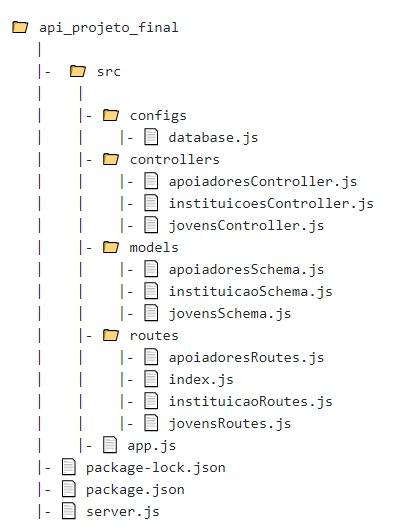

# Adote Futuros #

### Descrição ###
Entre os jovens que estão no sistema de adoção, quanto mais velhos ficam menores são as probabilidades de serem adotados. Quando pensamos nos jovens que não são adotados na infância, algo preocupante é a questão da educação básica, muitas vezes esses jovens que vieram de lares conturbados não conseguem concluir sequer o ensino fundamental devido a falta de oportunidade. Com isso em mente esse projeto visa expor essa realidade e procurar pessoas que deem apoio financeiro ou até mesmo de tempo (na forma de palestras ou aulas), de modo que isso ajude na instrução desses jovens. O apoio seria voltado para financiar cursos que instruam esses jovens sobre as possibilidades de carreiras profissionais e como prosseguir nos estudos para conseguir trabalhar na profissão que desejar. Desta forma os jovens não sairão desamparados para ingressar na sua vida adulta.

### Objetivo ###
- Auxiliar jovens que estão no sistema de adoção a se capacitarem profissionalmente, se valendo da ajuda de apoiadores.  

### Tecnologias ###
As tecnologias utilizadas para as o desenvolvimento desse projeto foram:

- JavaScript
- Node.js
- MongoDb
- Express
- Nodemon
- Mongoose
- dotenv
- Git/Github
- heroku

### Aprendizados ###
Durante todo o bootcamp da Reprograma fizemos diversas aulas e práticas que nos ajudaram a entender como desenvolver API's desse modelo. Nesta API eu utilizei as operações CRUD (Create Read, Update e Delete), sendo o banco de dados utilizado o MongoDB. Além disso, o código foi escrito seguindo a arquitetura MVC (Model View Controller).

### Rotas dos Apoiadores ###
- [X] "/apoiadores" Retorna todos os apoiadores cadastrados.
- [X] "cadastro_apoiador" Cria novo cadastro e retorna mensagem amigável.
- [X] "/encontrar_apoiador" Retorna o apoiador com o nome espécifico.
- [X] "/deletar_apoiador/[ID]" Deleta o apoiador por id específico e retorna mensagem amigável.
- [X] "/atualizar_apoiador/[ID]" Atualiza os dados do apoiador por id específico e retorna mensagem amigável.

### Rotas das Instituições ###
- [X] "/instituicoes" Retorna todas as instituições cadastradas.
- [X] "/cadastro_instituicao" Cria novo cadastro e retorna mensagem amigável.
-[X] "/encontrar_instituicao" Retorna a instituição com o nome espécifico.
- [X] "/deletar_instituicao/[ID]" Deleta a instituição por id específico e retorna mensagem amigável.
- [X] "/atualizar_instituicao/[ID]" Atualiza os dados da instituição por id específico e retorna mensagem amigável.

### Rotas das Instituições ###
- [X] "/jovens" Retorna todos os jovens cadastrados.
- [X] "/cadastro_jovem" Cria novo cadastro e retorna mensagem amigável.
- [X] "/encontrar_jovem" Retorna o jovem com o nome espécifico.
- [X] "/deletar_jovem/[ID]" Deleta o jovem por id específico e retorna mensagem amigável.
- [X] "/atualizar/nome/[ID]" Atualiza os dados do jovem por id específico e retorna mensagem amigável.

### Instruções para utilização da API ###

### Estrutura MVC ###

